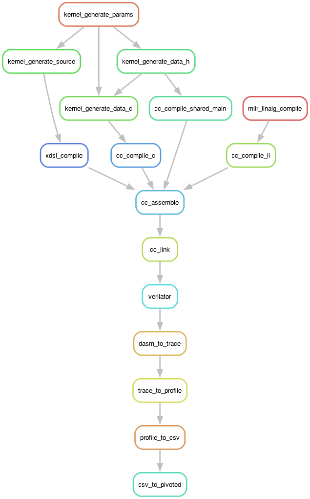
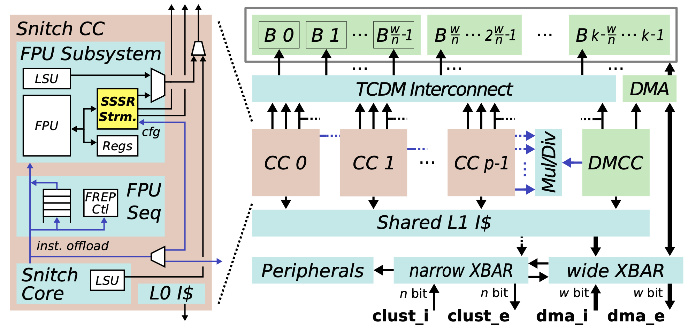

# riscv-paper-experiments

## RTL Simulation Quickstart

Let's start by spinning up the `snitch-toolchain` Docker container, mounting in it a clone of this repo at `/src` and running the whole test suite:

```shell
$ git clone --recursive https://github.com/opencompl/riscv-paper-experiments.git
$ docker run --rm -ti --volume $PWD/riscv-paper-experiments:/src ghcr.io/opencompl/snitch-toolchain:latest bash
$ cd /src
$ make
```

The same can be done in one shot:

```shell
$ git clone --recursive https://github.com/opencompl/riscv-paper-experiments.git
$ docker run -ti --volume ${PWD}/riscv-paper-experiments:/src ghcr.io/opencompl/snitch-toolchain:latest bash -c "make -C /src"
```

This builds the kernels, executes them with Verilator, processes the traces from these runs and plots the results.
The overall results are collated in the `pivoted.csv`, `pivoted_ipc.csv` and `pivoted_fpu.csv` files.
Individual CSV files per kernel directory contain the result in cycles for each version of the kernel.

*Note: if on macOS, be aware that the official Docker app is trash, [OrbStack](https://orbstack.dev/)
is highly recommended instead.*

*Note: if you're running Docker on an architecture other than `x86_64` (e.g.: Apple Silicon),
it's likely that your `docker run` command will complain about the image being `linux/amd64`.
Add the following option to explicitly ask for a specific platform:*

```shell
$ docker run --platform linux/amd64 ...
```

*Note: we use [Snakemake](https://snakemake.readthedocs.io/en/stable/) instead of `make` to manage our test suite. The test workflow is defined in the [Snakefile](kernels/Snakefile).*

To build RISC-V executables of specific tests, once inside the Docker container:

```shell
$ cd /src
$ snakemake --cores=1 kernels/saxpy/64xf32/linalg.x
$ ls kernels/saxpy/64xf32/*.x # linalg.x should exist if all went OK
```

*Note: since Snakemake is focused on the amount of resources available to the build process, it requires you to explicitly specify the number of cores you want to use. If you don't do so, it will complain.*

The [Snakefile](Snakefile) performs the following steps:

1. `.mlir` -> `.ll.mlir` (a.k.a. MLIR source that uses the LLVM dialect only) via `mlir-opt`
2. `.ll.mlir` -> `.ll` via `mlir-translate`
3. `.ll` -> `.ll12` (a.k.a. LLVM IR backported to a form compatible with LLVM 12) via [`tollvm12.py`](snitch/tollvm12.py)
4. `.ll12` -> `.o` via `clang`
5. `.o` -> `.x` via `lld`, linking the runtime and using the correct linker script to lay out the ELF file.

In visual terms, we can look at an overview of the overall build process for the whole test suite:



Once the ELF executable is ready, we can simulate its execution on a Snitch
cluster via the RTL simulator generated by Verilator:

```shell
$ cd /src
$ snakemake --cores=1 kernels/saxpy/64xf32/linalg.profile.json
```

The previous command should produce the following output upon execution:

```
Wrote 36 bytes of bootrom to 0x1000
Wrote entry point 0x80000000 to bootloader slot 0x1020
Wrote 38 bytes of bootdata to 0x1024
[Tracer] Logging Hart          8 to logs/trace_hart_00000008.dasm
[Tracer] Logging Hart          0 to logs/trace_hart_00000000.dasm
[Tracer] Logging Hart          1 to logs/trace_hart_00000001.dasm
[Tracer] Logging Hart          2 to logs/trace_hart_00000002.dasm
[Tracer] Logging Hart          3 to logs/trace_hart_00000003.dasm
[Tracer] Logging Hart          4 to logs/trace_hart_00000004.dasm
[Tracer] Logging Hart          5 to logs/trace_hart_00000005.dasm
[Tracer] Logging Hart          6 to logs/trace_hart_00000006.dasm
[Tracer] Logging Hart          7 to logs/trace_hart_00000007.dasm
```

Correct execution should return `0` when issuing `echo $?`.

*Note: while the `main` function is run by all the compute cores in the cluster,
the current startup code **returns the integer return value of the core no. 0 only**,
**return values of cores other than no. 0 are discarded**.*

Along with actual profiling results, the simulation produces execution traces:

```shell
$ ls kernels/saxpy/64xf32/linalg.logs/
kernels/saxpy/64xf32/linalg.logs/trace_hart_00000000.trace.txt  # decoded trace
kernels/saxpy/64xf32/linalg.logs/trace_hart_00000000.trace.json # json performance data per section
```

*Note: the current version of `spike-dasm` included in the Docker image doesn't support
Snitch custom instructions: while side effects are reported correctly, they show up as
`unknown` in the decoded trace.*

For each `snrt_mcycle()` call, the cycle timeline for the core is split in two regions,
before and after the call. In our [test runner](kernels/saxpy/main.c)
where we call `snrt_mcycle()` right before and after the measured kernel, we have the
following sequence of sections with the middle one being the one related to the kernel itself:

```shell
$ cat kernels/saxpy/64xf32/linalg.logs/trace_hart_00000000.trace.json
Performance metrics for section 0 @ (12, 719):
# ...

Performance metrics for section 1 @ (721, 1448):
tstart                                         0.0
fpss_loads                                     129
fpss_stores                                     64
tend                                           0.0
snitch_loads                                     0
snitch_avg_load_latency                          0
snitch_occupancy                            0.4332
snitch_fseq_rel_offloads                    0.4923
fseq_yield                                     1.0
fseq_fpu_yield                                 1.0
fpss_section_latency                            36
fpss_avg_fpu_latency                        3.1736
fpss_avg_load_latency                       1.0775
fpss_occupancy                              0.4202
fpss_fpu_occupancy                          0.1584
fpss_fpu_rel_occupancy                      0.3769
cycles                                         764
total_ipc                                   0.8534

Performance metrics for section 2 @ (1450, 3227):
# ...
```

Along with performance stats, the execution trace shows each instruction's
dispatch and retirement along the core's cycle timeline:

```shell
$ grep -B2 -A3 1322 kernels/saxpy/64xf32/linalg.logs/trace_hart_00000000.trace.txt
1320 M 0x800001e0 flw     ft0, 0(a5)    #; ft0  <~~ Word[0x100000c4]
1321 M 0x800001e8 flw     ft1, 0(a5)    #; ft1  <~~ Word[0x100001c4], (f:lsu) ft0  <-- 140.3935394
1322 M 0x800001ec fmul.s  ft0, ft0, fa0 #; ft0  = 140.3935394, fa0  = 97.6270065, (f:lsu) ft1  <-- 627.5956421
1323 M 0x800001f4 add     a5, a2, a3    #; a2  = 0x10000200, a3  = 208, (wrb) a5  <-- 0x100002d0
1324 M 0x800001f8 addi    a3, a3, 4     #; a3  = 208, (wrb) a3  <-- 212
1325 M                                  #; (f:fpu) ft0  <-- 13706.2011719

```

From the decoded trace we can see that we are spending:

* 2 cycles to load `rd`/`rs1` from L1 (cycles `1320:1321`,
  the constant was already materialized in `fa0`)
* 4 cycles to perform the actual multiplication (cycles `1322:1325`)

We can also check that the core is doing what we expect:

```shell
$ grep fmul\.s kernels/saxpy/64xf32/linalg.logs/trace_hart_00000000.trace.txt  | wc -l
64
$ grep fmul\.s kernels/saxpy/64xf32/linalg.logs/trace_hart_00000001.trace.txt  | wc -l
0
```

The core (a.k.a. *hart* in RISC-V terminology) no. 0 was the only one actually
executing the kernel, while all of the other cores did none as they early-return
from the `main` function.

## Running the full test suite

The root `Makefile` provides two different targets:

* `fast` (default target), completes as quickly as possible by running only 1 shape for each kernel. The CI runs this test set;
* `all`, runs everything that is needed for paper plots. **Warning: ~1300 Verilator simulations will be run**, so make sure to be on a beefy machine.

## Using Singularity instead of Docker

On multi-user systems (e.g.: HPC clusters) where Docker is not available, [Singularity](https://docs.sylabs.io/guides/3.5/user-guide/introduction.html) is usually provided as an *almost* drop-in replacement.
To run the experiments harness:

```shell
$ singularity pull snitch-toolchain.sif docker://ghcr.io/opencompl/snitch-toolchain:latest
$ singularity run --bind ${PWD}/riscv-paper-experiments:/src snitch-toolchain.sif bash -c "make -C /src"
```

## Performance Measurements

Alongside *execution traces*, *performance reports* are produced in the form
of `json` files summing up measurements for the Verilator run at hand.
Each counter refers to a specific *scope* in the Snitch cluster micro-architecture:



All the counters provided for each measurement section are listed below.

| Counter                    | Unit       | Scope           | Description                                                                                                                                                                                                                   |
| -------------------------- | ---------- | --------------- | ----------------------------------------------------------------------------------------------------------------------------------------------------------------------------------------------------------------------------- |
| `tstart`                   | cycles     | cc              | The global simulation time when the `mcycle` instruction opening the current measurement region is issued                                                                                                                     |
| `tend`                     | cycles     | cc              | The global simulation time when the `mcycle` instruction closing the current measurement region is issued                                                                                                                     |
| `start`                    | cycles     | cc              | The core complex cycle count when the `mcycle` instruction opening the current measurement region is issued                                                                                                                   |
| `end`                      | cycles     | cc              | The core complex cycle count when the `mcycle` instruction closing the current measurement region is issued                                                                                                                   |
| `end_fpss`                 | cycles     | cc > fpss       | The core complex cycle count when the last FP operation issued in the current measurement region retires                                                                                                                      |
| `snitch_issues`            | inst       | cc > snitch     | Total number of instructions issued by Snitch, excluding those offloaded to the FPSS (see `snitch_fseq_offloads`)                                                                                                             |
| `snitch_occupancy`         | inst/cycle | cc > snitch     | IPC of the Snitch core, calculated as `snitch_issues / cycles`                                                                                                                                                                |
| `snitch_fseq_offloads`     | inst       | cc > snitch     | No. of instructions offloaded by the Snitch to the FPSS                                                                                                                                                                       |
| `snitch_fseq_rel_offloads` | %          | cc > snitch     | The ratio between `snitch_fseq_offloads` and the total number of instructions issued by Snitch core proper, i.e. `snitch_issues + snitch_fseq_offloads`                                                                       |
| `snitch_load_latency`      | cycles     | cc > snitch     | Cumulative latency of all loads issued by Snitch's own LSU. The latency of a load is measured from the cycle the load is issued to the cycle it is retired, i.e. it writes back to the register file. See `fpss_load_latency` |
| `snitch_avg_load_latency`  | cycles     | cc > snitch     | Average latency of a load issued by Snitch own LSU (see `snitch_load_latency`)                                                                                                                                                |
| `snitch_loads`             | inst       | cc > snitch     | No. of load instructions retired by the Snitch own LSU                                                                                                                                                                        |
| `fseq_yield`               | %          | cc > fseq       | The ratio between `fpss_issues` and `snitch_fseq_offloads`. The difference lies in the FREP sequencer possibly replicating instructions. If the sequencer is not used this ratio should amount to 1                           |
| `fseq_fpu_yield`           | %          | cc > fseq       | **FIXME** Currently identical to `fseq_yield`, **probably a bug in the trace postprocessor**. Most likely originally intended to be the ratio between `fpss_fpu_issues` and `snitch_fseq_offloads`                            |
| `fpss_issues`              | inst       | cc > fpss       | Total number of instructions issued by the FPSS. It counts repeated issues from the FREP sequencer                                                                                                                            |
| `fpss_fpu_issues`          | inst       | cc > fpss > fpu | Similar to `fpss_issues`, but counts only instructions destined to the FPU proper. It does not for instance include instructions issued to the FPSS own LSU                                                                   |
| `fpss_fpu_latency`         | cycles     | cc > fpss > fpu | Cumulative latency of all FPU instructions. The latency of an FPU instruction is measured from the cycle the instruction is issued to the cycle it is retired, i.e. it writes back to the register file                       |
| `fpss_avg_fpu_latency`     | cycles     | cc > fpss > fpu | Average latency of an FPU instruction (see `fpss_fpu_latency`)                                                                                                                                                                |
| `fpss_load_latency`        | cycles     | cc > fpss       | Cumulative latency of all loads issued by FPSS own LSU. The latency of a load is measured from the cycle the load is issued to the cycle it is retired, i.e. it writes back to the register file. See `snitch_load_latency`   |
| `fpss_avg_load_latency`    | cycles     | cc > fpss       | Average latency of a load issued by FPSS own LSU (see `fpss_load_latency`)                                                                                                                                                    |
| `fpss_loads`               | inst       | cc > fpss       | No. of load instructions retired by the FPSS own LSU                                                                                                                                                                          |
| `fpss_section_latency`     | cycles     | cc > fpss       | `max(end_fpss - end, 0)`                                                                                                                                                                                                      |
| `fpss_occupancy`           | inst/cycle | cc > fpss       | IPC of the FPSS, calculated as `fpss_issues / cycles`                                                                                                                                                                         |
| `fpss_fpu_occupancy`       | inst/cycle | cc > fpss > fpu | IPC of the FPU, calculated as `fpss_fpu_issues / cycles`                                                                                                                                                                      |
| `fpss_fpu_rel_occupancy`   | %          | cc > fpss > fpu | The ratio between `fpss_fpu_occupancy` and `fpss_occupancy`, equals to `fpss_fpu_issues / fpss_issues`                                                                                                                        |
| `cycles`                   | cycles     | cc              | Overall cycles spent in the current measurement region, calculated as `max(end, end_fpss) - start + 1`                                                                                                                        |
| `total_ipc`                | inst/cycle | cc              | The overall IPC of the core complex, calculated as `snitch_occupancy + fpss_occupancy`                                                                                                                                        |
